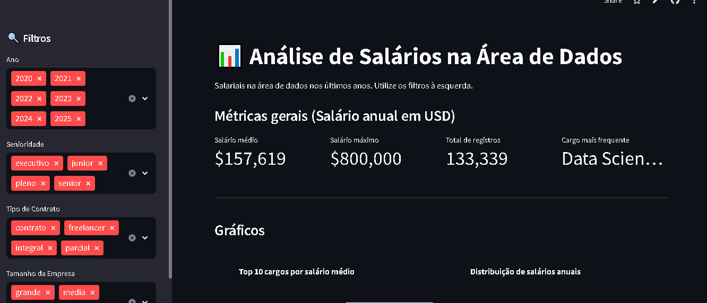

# 📊 Análise de Salários na Área de Dados

Este projeto tem como objetivo analisar salários na área de dados ao longo dos últimos anos, identificando padrões relevantes por senioridade, tipo de contrato, tamanho da empresa e localização.

A análise foi desenvolvida em Python, com visualização interativa utilizando Streamlit.

---

## 🎯 Objetivo

Entender como diferentes fatores influenciam os salários na área de dados, como:

- Senioridade (Júnior, Pleno, Sênior)
- Tipo de contrato
- Tamanho da empresa
- Localização
- Tipo de trabalho (remoto, híbrido, presencial)

Este tipo de análise pode ajudar profissionais a:
- Tomar decisões de carreira
- Negociar salários
- Identificar oportunidades no mercado

---

## 🛠️ Tecnologias utilizadas

- Python
- Pandas
- Streamlit
- Plotly

---

## 📊 Funcionalidades

- Filtros interativos por:
  - Ano
  - Senioridade
  - Tipo de contrato
  - Tamanho da empresa

- Métricas principais:
  - Salário médio
  - Salário máximo
  - Total de registros
  - Cargo mais frequente

- Visualizações:
  - Top 10 cargos por salário médio
  - Distribuição de salários
  - Proporção de trabalho remoto
  - Salário médio de Cientistas de Dados por país

---

## 📈 Principais Insights

- Profissionais mais experientes apresentam salários significativamente maiores
- Trabalhos remotos representam uma parcela relevante das oportunidades
- Existe grande variação salarial entre países
- Certos cargos possuem médias salariais muito acima da média geral

*(Obs: esses insights podem ser refinados conforme análise mais aprofundada dos dados)*

---

## 🚀 Como executar o projeto

1. Clone o repositório:

```bash
git clone https://github.com/jh0rdanp/analise_salarios-area_de_dados.git
```


2. Instale as dependências:
```bash
pip install -r requirements.txt
```


3. Execute o app:
```bash
streamlit run app.py
```

## 🎥 Demonstração


